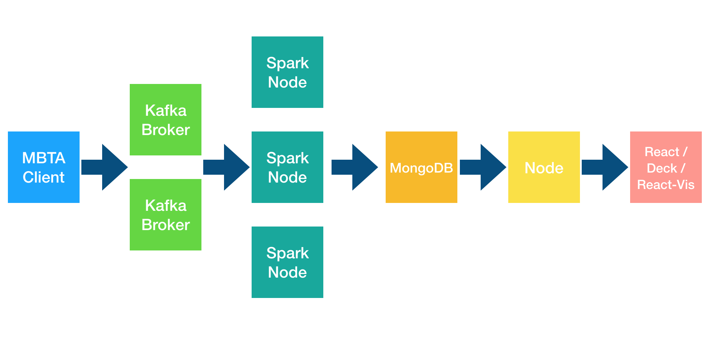
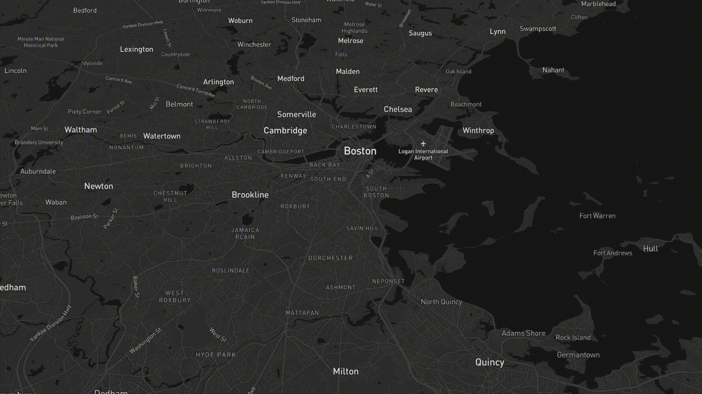
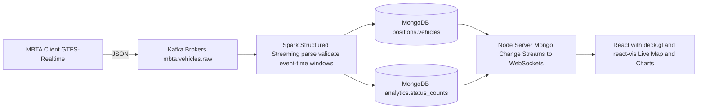
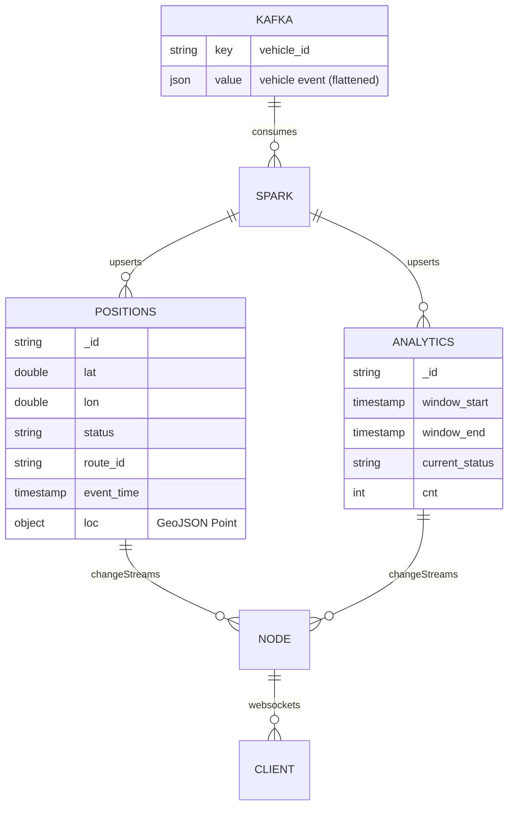
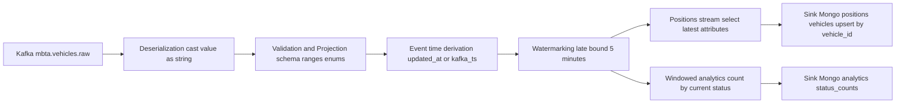
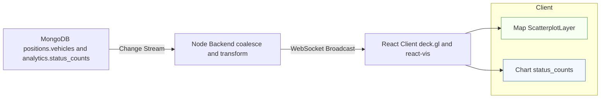
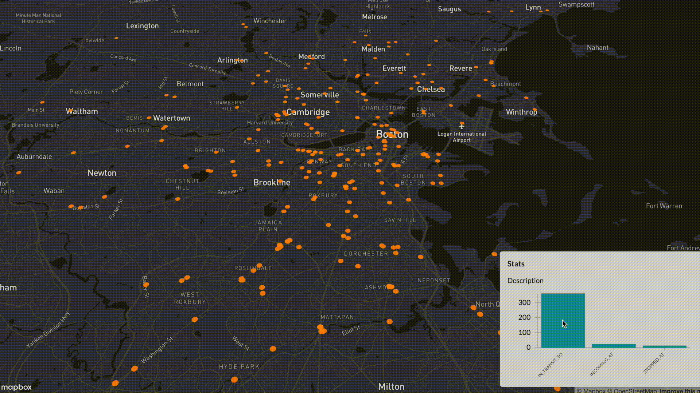
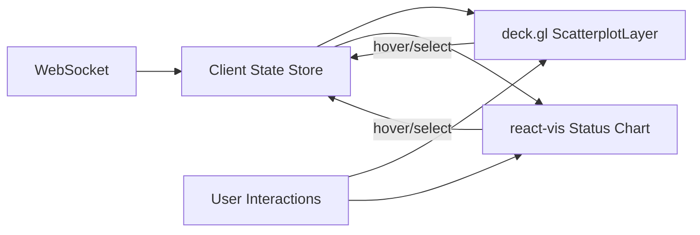
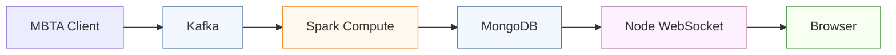
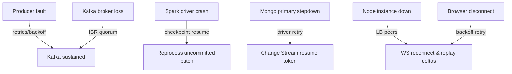

# MBTA Real-Time Geospatial Analytics — Kafka • Spark Structured Streaming • MongoDB • Node • React/deck.gl

**Tagline:** *GTFS-Realtime → Kafka → Spark (event-time windows) → MongoDB Change Streams → Node (WebSockets) → React + deck.gl (live map) + react-vis (live charts).*

<p align="center">
  
</p>

<p align="center">
  
  <br/><em>Vehicles stream onto the map in real time; chart widgets update from the same flow.</em>
</p>

---

## 1) Executive Summary & System Overview

**What this is**  
A production-style, low-latency **geospatial streaming system** that ingests **MBTA GTFS-Realtime** vehicle events, processes them with **Spark Structured Streaming**, persists/query-optimizes them in **MongoDB**, and serves them to a **React/deck.gl** front-end via a **Node** server and **WebSockets**. The UI shows live vehicles and status analytics (e.g., `IN_TRANSIT_TO`, `INCOMING_AT`, `STOPPED_AT`) with map-chart linking.

**Why it matters**  
- Demonstrates **streaming data engineering** (Kafka topics, consumer groups, backpressure, DLQ).  
- Shows **stateful event-time analytics** (Spark windows, watermarks, idempotent sinks).  
- Implements a **geospatial serving layer** (MongoDB `2dsphere` indexes + Change Streams).  
- Proves **real-time UX** skills (React + deck.gl + react-vis + WS fan-out).  
- Cleanly separates **ingest → compute → store → serve → visualize** for scale & reliability.

**What this repo proves (your skills)**  
- **Distributed Streaming:** Kafka partitioning, Spark micro-batch triggers, event-time semantics, watermarking.  
- **Geospatial Engineering:** geo-schema design, fast point rendering, geo-indexes, map/chart cross-filtering.  
- **Ops & Reliability:** checkpoints, idempotent upserts, change-data propagation, observability hooks.  
- **Full-Stack Integration:** Python producer ↔ Kafka ↔ Spark ↔ MongoDB ↔ Node/WS ↔ React/deck.gl.

---

### 1.1 High-Level Pipeline



**Flow Notes**
- **Ingest:** Python MBTA client publishes flattened **GTFS-RT JSON** to a **Kafka topic** keyed by `vehicle_id`.  
- **Compute:** Spark reads Kafka, parses JSON permissively, derives event time from message timestamps or feed fields, applies `withWatermark` and **tumbling/sliding windows** for counts by `current_status`.  
- **Store:** Writes positions and windowed analytics to **MongoDB**; collections are indexed for **geo** and **query speed**.  
- **Serve:** **MongoDB Change Streams** push deltas to **Node.js**; Node broadcasts via **WebSockets** to the browser.  
- **Visualize:** **React** renders a **deck.gl ScatterplotLayer** over **Mapbox** plus **react-vis charts**; hover/selection links map and chart.

---

### 1.2 Component Roles & Interfaces

| **Layer**            | **Component**                      | **Key Responsibilities**                                                                 | **I/O Contract**                                                                 |
|-----------------------|------------------------------------|------------------------------------------------------------------------------------------|----------------------------------------------------------------------------------|
| **Ingest**           | MBTA Client (Python)               | Polls MBTA v3 vehicles; normalizes JSON; publishes to Kafka with `key=vehicle_id`         | Kafka topic: `mbta.vehicles.raw` (value = JSON)                                  |
| **Streaming Compute**| Spark Structured Streaming (PySpark)| Parse/validate; derive event-time; `withWatermark`; windowed counts by `current_status`; enrichment hooks | Kafka → Spark DF; sinks → MongoDB collections                                    |
| **Storage**          | MongoDB (replica set)              | Durable store for positions & aggregates; Change Streams for push-based serving; `2dsphere` index | Collections: `positions.vehicles`, `analytics.status_counts`                      |
| **Serving**          | Node                               | Subscribes to Change Streams; applies small coalescing buffer; pushes updates via WebSockets/Socket.IO | WS payloads: `{ type: "positions", ... }`                                       |
| **Frontend**         | React + deck.gl + react-vis        | Live map (Mapbox tile); batched point updates; linked bar chart (status counts); hover highlight | WebSocket stream; throttled rendering; map/chart cross-filter                     |

---

### 1.3 Guarantees & Semantics (at a glance)

- **Delivery:** Kafka/Spark *at-least-once*; exactly-once effect at Mongo via **idempotent keys + Spark checkpointing**  
- **Ordering:** Per-vehicle ordering preserved by Kafka **partition key = vehicle_id**  
- **Time Model:** Event-time windows with `withWatermark("event_time", "5 minutes")` (configurable)  
- **Backpressure:** Spark `maxOffsetsPerTrigger` caps ingress; Node coalesces WebSocket updates  
- **Observability:** Kafka lag metrics; Spark Streaming UI; MongoDB ops stats; front-end FPS throttling  

---

### 1.4 Tech Stack (reference build)

- **Kafka** (topics, partitions, consumer groups)  
- **Spark 2.x / 3.x** + `spark-sql-kafka` + **Mongo Spark Connector**  
- **MongoDB** (replica set for Change Streams, `2dsphere` index)  
- **Node.js** (WebSockets / Socket.IO)  
- **React + deck.gl (Mapbox)** + **react-vis** (charts)  

---


## 2) Data Contracts & Topic/Collection Design

This section pins down **exact JSON payloads, keys, topics, partitions, retention, DLQ**, and the **MongoDB collections + indexes** that make the pipeline reliable and query-fast. It also includes **idempotency keys** so the sink behaves with “exactly-once effect”.

---

### 2.1 Kafka Topics (ingress & safety)

| Topic                  | Purpose                          | Key                | Partitions | Retention | Cleanup | Notes |
|------------------------|----------------------------------|--------------------|------------|-----------|---------|-------|
| `mbta.vehicles.raw`    | Raw GTFS-Realtime vehicle events | `vehicle_id` (str) | 6–12       | 1–7 days  | delete  | Per-vehicle ordering; replay support |
| `mbta.events.dlq`      | Dead-letter (parse/validation)   | none/`vehicle_id`  | 1–3        | 30 days   | delete  | Keep bad records for root cause |

**Create topics (example):**
```bash
kafka-topics --bootstrap-server localhost:9092 \
  --create --topic mbta.vehicles.raw \
  --partitions 12 --replication-factor 1 \
  --config retention.ms=604800000   # 7 days

kafka-topics --bootstrap-server localhost:9092 \
  --create --topic mbta.events.dlq \
  --partitions 3 --replication-factor 1 \
  --config retention.ms=2592000000  # 30 days
```
---

### 2.2 Kafka Message Contract (value = JSON)

Producer → mbta.vehicles.raw (flattened GTFS-RT vehicle):
```json
{
  "vehicle_id": "y1731",
  "label": "1731",
  "route_id": "1",
  "stop_id": "64",
  "trip_id": "T12345",
  "latitude": 42.35187,
  "longitude": -71.07093,
  "bearing": 136.0,
  "speed": 7.2,
  "current_status": "IN_TRANSIT_TO",
  "updated_at": "2025-01-19T17:05:42Z",
  "producer_ts_ms": 1737309942123
}
````
**Notes**
- **Key:** `vehicle_id` → preserves per-vehicle order  
- **Event-time:** `updated_at` (ISO-8601) from MBTA feed  
- **Producer timestamp:** `producer_ts_ms` records client send time (debugging)  

**Validation Rules (Ingest)**
- `latitude ∈ [-90, 90]`  
- `longitude ∈ [-180, 180]`  
- `current_status ∈ {"IN_TRANSIT_TO", "INCOMING_AT", "STOPPED_AT"}`  

If schema fails → **drop or route to DLQ**, else **publish** to Kafka  

---

### 2.3 Spark Ingest Schema (strict)

```python
from pyspark.sql.types import *
vehicle_schema = StructType([
  StructField("vehicle_id", StringType(), False),
  StructField("label", StringType(), True),
  StructField("route_id", StringType(), True),
  StructField("stop_id", StringType(), True),
  StructField("trip_id", StringType(), True),
  StructField("latitude", DoubleType(), True),
  StructField("longitude", DoubleType(), True),
  StructField("bearing", DoubleType(), True),
  StructField("speed", DoubleType(), True),
  StructField("current_status", StringType(), True),
  StructField("updated_at", TimestampType(), True),  # event-time
  StructField("producer_ts_ms", LongType(), True)
])
```

Event-time & watermark config (Spark):
```python
events = (spark.readStream.format("kafka")
  .option("kafka.bootstrap.servers","localhost:9092")
  .option("subscribe","mbta.vehicles.raw")
  .option("startingOffsets","latest")
  .load()
  .selectExpr("CAST(key AS STRING) AS k","CAST(value AS STRING) AS v","timestamp AS kafka_ts")
)

parsed = (events
  .withColumn("json", from_json(col("v"), vehicle_schema))
  .select("kafk a_ts","json.*")                     # typo-safe in your editor :)
  .withColumn("event_time", coalesce(col("updated_at"), col("kafka_ts")))
  .withWatermark("event_time","5 minutes")          # tolerate small disorder
)
```
---

### 2.4 Derived Streams (for sinks)

**Positions stream (latest locations; upsert by vehicle_id)**
```python
positions = parsed.select(
  col("vehicle_id"),
  col("latitude").alias("lat"),
  col("longitude").alias("lon"),
  "bearing","speed","current_status","route_id","stop_id","trip_id",
  "event_time"
)
```

**Status counts (windowed analytics)**
```python
status_counts = (parsed
  .groupBy(window(col("event_time"), "60 seconds", "30 seconds"),
           col("current_status"))
  .count()
  .select(
    col("window.start").alias("window_start"),
    col("window.end").alias("window_end"),
    col("current_status"),
    col("count").alias("cnt"),
    current_timestamp().alias("last_update_ts")
))
```

---

### 2.5 MongoDB Collections & Indexes

**Collections**
- **`positions.vehicles`** → latest per-vehicle document (**idempotent upsert**)  
- **`analytics.status_counts`** → sliding/tumbling window aggregates  

---

**Idempotent Keys**
- **`positions.vehicles._id = vehicle_id`** → 1 record per vehicle → simple upsert  
- **`analytics.status_counts._id = sha1(window_start | window_end | current_status)`**  

**Indexes:**
```js
// positions: geo + lookup
db.getSiblingDB("positions").vehicles.createIndex({ vehicle_id: 1 }, { unique: true })
db.getSiblingDB("positions").vehicles.createIndex({ loc: "2dsphere" }) // if storing GeoJSON

// analytics: query by window/time/status
db.getSiblingDB("analytics").status_counts.createIndex({ window_start: 1, window_end: 1, current_status: 1 })
```

**Document shapes**

1) positions.vehicles
```json
{
  "_id": "y1731",
  "vehicle_id": "y1731",
  "lat": 42.35187,
  "lon": -71.07093,
  "bearing": 136.0,
  "speed": 7.2,
  "status": "IN_TRANSIT_TO",
  "route_id": "1",
  "stop_id": "64",
  "trip_id": "T12345",
  "event_time": "2025-01-19T17:05:42Z",
  "loc": { "type": "Point", "coordinates": [-71.07093, 42.35187] },
  "updated_at": "2025-01-19T17:05:42Z",
  "ingested_at": "2025-01-19T17:05:45Z"
}
```

2) analytics.status_counts
```json
{
  "_id": "e4f3…",           // sha1(window_start|window_end|current_status)
  "window_start": "2025-01-19T17:05:00Z",
  "window_end":   "2025-01-19T17:06:00Z",
  "current_status": "IN_TRANSIT_TO",
  "cnt": 834,
  "last_update_ts": "2025-01-19T17:06:01Z"
}
```

---

### 2.6 Spark → Mongo (idempotent upserts)

**Positions (foreachBatch)**
Use _id=vehicle_id to guarantee last-write wins and avoid duplicates.
```python
def upsert_positions(batch_df, batch_id):
    (batch_df
      .withColumn("_id", col("vehicle_id"))
      .withColumn("loc", expr("struct('Point' as type, array(lon, lat) as coordinates)"))
      .write.format("mongo")
      .option("uri","mongodb://localhost/positions.vehicles")
      .mode("append")  # connector performs upsert when _id present
      .save())

(positions.writeStream
  .foreachBatch(upsert_positions)
  .outputMode("update")
  .option("checkpointLocation","checkpoint/positions")
  .start())
```

**Status counts (append or merge)**
Deterministic _id from (window,status) → idempotent.
```python
from pyspark.sql.functions import sha1, concat_ws

sc_upserts = (status_counts
  .withColumn("_id", sha1(concat_ws("|",
      col("window_start").cast("string"),
      col("window_end").cast("string"),
      col("current_status"))))
)

def upsert_counts(batch_df, batch_id):
    (batch_df.write
      .format("mongo")
      .option("uri","mongodb://localhost/analytics.status_counts")
      .mode("append")
      .save())

(sc_upserts.writeStream
  .foreachBatch(upsert_counts)
  .outputMode("update")
  .option("checkpointLocation","checkpoint/status_counts")
  .start())
```
---

### 2.7 Serving Contract (Node WS payloads)

**Change Streams → WS broadcast**

- Channel "positions": array of {_id, lat, lon, status, route_id, event_time}

- Channel "status_counts": array of {window_start, window_end, current_status, cnt}

---

### 2.8 Contract Diagram (ER / streams view)



The data layer is precisely specified: Kafka topic contracts (keys/values/headers), Spark schemas & watermarks, and Mongo collection shapes with idempotent keys + indexes. These choices guarantee ordering, replayability, low-latency serving, and “exactly-once effect” at the sink, making the rest of the system stable and scalable.

---

## 3) Streaming Compute (Spark Structured Streaming)

This stage turns raw Kafka messages into **validated geospatial events** and **real-time analytics** with **event-time guarantees**. It is designed for **low latency**, **replayability**, and **exactly-once effect** at the sinks.

---

### 3.1 Responsibilities & Boundaries

- **Contract enforcement:** validate JSON payloads, types, and domain ranges (lat/lon, `current_status`).
- **Event-time model:** derive `event_time` from MBTA’s timestamp (fallback to Kafka timestamp), apply **watermarks**.
- **Windowed analytics:** counts by `current_status` on **tumbling/sliding windows**.
- **Sink idempotency:** write **positions** (upsert by `vehicle_id`) and **status_counts** (deterministic `_id` for each window/status).
- **Resilience:** recover from restarts via **checkpointed offsets + state**.
- **Backpressure:** cap intake with `maxOffsetsPerTrigger`; prefer small, predictable micro-batches.

---

### 3.2 Dataflow (within Spark)



**Why this shape works**

- Enforces contracts early → prevents downstream pollution.
- Event-time + watermarking → correct aggregations with late arrivals.
- Two independent sinks → decoupled serving (live map vs charts) and easier scaling.

---

### 3.3 Time & Windows (Semantics)

| **Concept**   | **Choice / Example**                                | **Why it matters**                                       |
|---------------|------------------------------------------------------|----------------------------------------------------------|
| **Event time** | `event_time = updated_at`                           | Ensures results align with actual event occurrence       |
| **Watermark** | `withWatermark("event_time", "5 minutes")`           | Bounded state; tolerates moderate latency                |
| **Windows**   | Tumbling 60s (optional slide 30s)                    | Smooth charts; predictable update cadence                |
| **Late data** | Dropped after watermark horizon                      | Prevents unbounded state growth                          |

**Tuning note:**  
Adjust the watermark to your expected network/API jitter.  
- Too **small** → drop valid late events  
- Too **large** → excessive state retained  

---

### 3.4 Reliability & Exactly-Once Effect

- **At-least-once upstream:** Kafka + Spark  
- **Exactly-once effect at sink** via idempotent keys:  
  - `positions.vehicles` → `_id = vehicle_id` (last-write wins)  
  - `analytics.status_counts` → `_id = hash(window_start | window_end | current_status)`  
- **Checkpointing** stores consumer offsets + window state:  
  - Path: `checkpoint/positions` and `checkpoint/status_counts`  
- On restart, Spark replays only what was not committed  

---

### 3.5 Quality & Guardrails

- **Schema checks:** required fields present; correct types; coercion with reject-to-DLQ for bad records  
- **Domain checks:** latitude/longitude ranges; `current_status` enum; negative speeds rejected or zeroed  
- **Poison message strategy:** route to `mbta.events.dlq` with a `reason` field; never block the stream  
- **Observability hooks:** log per-batch counts (ingested, valid, invalid, late-dropped)  

---

### 3.6 Tuning & Backpressure

| **Lever**                | **Default / Start**       | **Impact**                                     |
|---------------------------|---------------------------|------------------------------------------------|
| `maxOffsetsPerTrigger`    | 10k–50k msgs/batch        | Caps batch size for predictable latency        |
| Micro-batch trigger       | `ProcessingTime=5s`       | Keeps UI responsive without thrash             |
| `spark.sql.shuffle.partitions` | ≈ total cores (e.g., 48) | Controls shuffle parallelism                   |
| Kafka partitions          | 6–12                      | Align with Spark tasks; allow headroom         |
| Serialization             | JSON (consider Avro)      | JSON = flexible; Avro = schema safety          |

In practice: target **batch time < trigger interval**.  
If batches pile up → reduce `maxOffsetsPerTrigger` or add Kafka partitions / Spark cores.  

---

### 3.7 Failure Modes & Recovery

- **Spark driver crash:** restart → re-attach to checkpoints; re-emit only missing upserts (idempotent)  
- **Mongo transient error:** sink retries; duplicates prevented by `_id` key  
- **Kafka outage:** Spark waits; upon recovery, resumes from last committed offset  
- **Skew (hot routes/vehicles):** monitor partition skew; mitigate by increasing partitions or adding salting key for analytics stream  

---

### 3.8 Testing Strategy (Stream-Native)

- **Contract tests:** feed fixed valid/invalid JSON events → expect counts, DLQ size, no exceptions  
- **Time semantics tests:** synthetic late events (e.g., 2–4 min behind) → verify included; >5 min → dropped  
- **Idempotency tests:** replay same micro-batch → Mongo docs and windows remain stable (no dupes)  
- **Throughput tests:** progressively raise `maxOffsetsPerTrigger`; monitor Spark UI + WS client FPS  

---

### 3.9 What Reaches the Frontend (Summary)

- **Positions feed:** near-real-time snapshots keyed by `vehicle_id` (map points)  
- **Status_counts feed:** windowed aggregates for bar chart (`IN_TRANSIT_TO`, `INCOMING_AT`, `STOPPED_AT`)  
- Both pushed via **Mongo Change Streams → Node WebSockets** → sub-second UI updates

---

<p align="center">  </p>

---

## 4) Storage & Serving — MongoDB (Change Streams) + Node WebSockets

This stage turns **analytical writes** from Spark into **push-based realtime updates** for the UI.  
MongoDB acts as the **serving store** (durable, queryable, geo-indexed), while **Change Streams** notify a **Node server** which fans-out updates over **WebSockets** to the React client.

---

### 4.1 Serving Responsibilities & Contracts

- **Durability & Queryability:** Persist **positions** (latest per vehicle) and **status_counts** (windowed aggregates) in MongoDB.
- **Push, not Poll:** Use **Change Streams** so the backend learns about changes the moment Spark writes them.
- **Consistent Keys:** Enforce **idempotent keys** (e.g., `_id=vehicle_id` for positions; `_id=hash(window,status)` for counts) so replays or retries don’t duplicate rows.
- **Low-Latency Fan-Out:** The Node server accepts change notifications and pushes small, coalesced updates via **WebSockets** (or Socket.IO) to all connected browsers.

---

### 4.2 Collections, Indexes, & Access Patterns

**Collections**
- `positions.vehicles` — **latest** document per `vehicle_id` (one row per vehicle).
- `analytics.status_counts` — **time-windowed** aggregates (`window_start`, `window_end`, `current_status`, `cnt`).

**Indexes**
- `positions.vehicles`: 
  - `{ vehicle_id: 1 }` **unique** — write is upsert-by-id (last-write wins).
  - `{ loc: "2dsphere" }` — for optional geo-queries (nearest stop, within bbox).
- `analytics.status_counts`:
  - `{ window_start: 1, window_end: 1, current_status: 1 }` — retrieval by rolling window and status.

**Primary Reads**
- UI *map* → subscribe to **positions** stream (WS) and maintain a client-side index keyed by `vehicle_id`.
- UI *bar chart* → subscribe to **status_counts** stream (WS) and update short-lived series per window/status.

> This separation (positions vs analytics) isolates **high-churn tiny updates** (points) from **low-churn periodic** updates (windows), enabling independent scaling and caching.

---

### 4.3 Change Streams → Node → WebSocket Flow



**Design choices that reduce jitter & CPU:**
- Coalescing window: Batch small bursts (e.g., 50–100 ms) to avoid WS spam while staying “live”.
- Minimal payloads: Only send diffs or small aggregates, not entire collections.
- Compression (optional): Enable permessage-deflate for high-density updates.

---

### 4.4 Delivery Guarantees & Idempotency at Serve Layer

- **Upstream:** Spark = *at-least-once*; Mongo upserts guarantee **idempotent writes**  
- **Change Streams:** Emit **exactly-once notifications** per committed document change  
- **Node fan-out:** Stateless; duplicates harmless (UI uses last-write-wins by `vehicle_id` and `(window, status)` keys)  
- **Client state:** Each payload replaces/patches a keyed entry → no cumulative drift  

---

### 4.5 Throughput, Backpressure & Smoothing

| **Lever**              | **Where**       | **Purpose**                                      | **Typical Setting**          |
|-------------------------|-----------------|--------------------------------------------------|------------------------------|
| `maxOffsetsPerTrigger` | Spark           | Cap batch size → steadier Mongo write rate       | 10k–50k events/batch         |
| Coalescing delay        | Node            | Group change notifications → fewer WS frames     | 50–200 ms                    |
| WS frame size limit     | Node/Browser    | Prevent large payloads                           | 0.5–2 MB                     |
| Downsampling markers    | Client          | Reduce overdraw at low zooms → send 1/N or cluster| —                            |
| Batching chart windows  | Client          | Append/prepend only new windows                  | 1–2 windows/update           |

---

### 4.6 Security & Multi-Tenancy

### Mongo
- Auth enabled → least-privilege role for Spark writer & Node reader  
- TLS on Mongo connections if crossing networks  

### Node
- API key / JWT gate for WS upgrade  
- CORS restricted to front-end origin  
- Optional `tenant_id` in collections and WS channels for **multi-tenant partitioning**  

### Secrets
- Keep connection strings and API keys **out of source**  
- Use **environment variables** or secret managers  

---

### 4.7 Resilience & Ops

- **Replica Set Required:** Change Streams need MongoDB replica set (even single-node RS in dev)  
- **Automatic Recovery:** Node reconnects on Mongo topology changes; Spark retries transient write errors  
- **Crash Safety:** Idempotent sink = safe replay of Spark micro-batch; clients reconcile by keys  

**Observability**
- Mongo: `db.currentOp()`, profiler for slow ops, collection stats  
- Node: WS connection count, broadcast queue depth, per-second frames  
- Client: FPS limiter & dropped-frame counters for diagnostics  

---

### 4.8 Alternate Serving Designs (when load grows)

- **Fan-out via Redis Pub/Sub:** Node subscribes to Mongo Change Streams → pushes to Redis channels → multiple WS nodes scale horizontally behind a load balancer  
- **CQRS Split:** Keep operational collections (positions) separate from analytical collections (aggregates/history) to optimize indexes and lock patterns independently  
- **Delta Lake Sidecar:** Persist immutable historical events to Parquet/Delta for BI/replay while Mongo handles live serving  

---

<p align="center">  </p>

---

## 5) Real-Time Frontend — React + deck.gl (Mapbox) + react-vis (Charts)

The UI turns **push-based streams** into a **live geospatial dashboard**. It is engineered for **clarity at city scale**, **smooth rendering under bursty updates**, and **linked interactions** between the map and charts.

---

### 5.1 Goals & UX Principles

- **Immediate situational awareness:** moving vehicles, their status distribution, and recent trends.
- **Low-latency rendering:** maintain 40–60 FPS under continuous updates.
- **Linked insights:** hovering bars highlights vehicles in that status; selecting map extents filters chart counts.
- **Fail-soft:** if the stream hiccups, the UI degrades gracefully (retry & stale-state badges).

---

### 5.2 Data Flow (Browser)



### 5.3 Geospatial Rendering (deck.gl)

- **Basemap:** Mapbox (vector tiles) with light theme for contrast  
- **ScatterplotLayer:**  
  - `getPosition = [lon, lat]`  
  - `getRadius = dynamic`  
  - `getFillColor = by-status`  
  - GPU instancing → cheap rendering of thousands of markers  
- **Visual encoding:**  
  - `IN_TRANSIT_TO` → blue  
  - `INCOMING_AT` → orange  
  - `STOPPED_AT` → red  
  - Size encodes speed (min clamp) to separate stationary vs moving  
- **Interaction:**  
  - Pickable points → tooltip: route, status, updated time  
  - Brushing (optional): drag a lasso to filter status counts to the brushed region  
- **Performance levers:**  
  - Point thinning/clustering → downsample at low zoom or aggregate into cluster icons  
  - Frame coalescing → render at most once per animation frame (`rAF`); batch WS updates  
  - Viewport culling → rely on deck.gl’s frustum culling; optionally send only vehicles in current bbox  

---

### 5.4 Live Analytics (react-vis)

- **Bar chart:** keyed by `current_status` with latest window counts  
- **Rolling series:** optional small multiples to show last *N* windows per status  
- **Linked highlighting:** hover a bar → emphasize vehicles with that status on map (alpha/outline change)  
- **Time axis alignment:** ensure chart windows match Spark’s tumbling/slide settings to avoid drift  

---

### 5.5 State Model (Minimal but Robust)

- **positionsById:** `Map<vehicle_id, Vehicle>` → last-write-wins; TTL optional (fade after N mins)  
- **statusWindows:** `Deque<Window>` → append-only, fixed length (e.g., last 60 windows)  
- **ui:** `{ hoveredStatus?, hoveredVehicleId?, bbox?, streamHealthy }`  

**Update policy**  
- Idempotent patches keyed by `vehicle_id` and `(window_start, status)`  
- Debounced selectors recompute derived arrays only when upstream data changes  

---

### 5.6 Resilience & UX Guardrails

- **Connection lifecycle:** exponential backoff on WS disconnect; badge `"Reconnecting…"`  
- **Staleness signal:** if no updates > 2× window size → show `"Data delayed"` pill  
- **Clock skew:** display server `last_update_ts`; don’t trust browser clock for event-time labeling  
- **Accessibility:** high-contrast palette; tooltips with readable timestamps; keyboard navigation for charts  

---

### 5.7 Security & Privacy (Browser)

- No secrets in client bundle  
- Tokens are **short-lived JWTs**, scoped to **read-only WS channels**  
- Enforce same-origin or explicit **CORS allowlist**  
- Lock down Mapbox tokens to domain  

---

### 5.8 Frontend Observability

- **Counters:** frames/sec (FPS), dropped WS frames, avg payload size  
- **Timers:** latency from Mongo write → WS receipt → first paint  
- **Error hooks:** capture parsing issues or NaNs in payloads; surface to non-blocking console panel  

---

## 6) Ops Runbook — Bring-Up, Config, and Day-2

A production-style cheat sheet to **start, stop, and keep it healthy** across all services.

---

### 6.1 Bring-Up Order (local dev)

1) **Kafka**: start ZooKeeper (if used) then brokers  
2) **MongoDB (replica set)**: init RS (Change Streams require RS)  
3) **Spark job**: Structured Streaming (Kafka → Mongo) with checkpoints  
4) **Node server**: subscribes to Change Streams → WebSockets  
5) **React client**: connects to WS and renders  
6) **MBTA client**: begins publishing GTFS-Realtime → Kafka

> Rationale: **sinks first, sources last** so nothing is dropped and consumers are ready.

---

### 6.2 Minimal Config (env & knobs)

| Layer | Key Config | Why |
|------|------------|-----|
| Kafka | `num.partitions=6..12`, `retention.ms=7d`, `replication.factor` (prod) | Replay headroom; concurrency |
| Spark | `maxOffsetsPerTrigger=10k..50k`, `ProcessingTime=5s`, `spark.sql.shuffle.partitions≈cores` | Smooth latency; stable shuffles |
| Mongo | Replica set enabled; `wiredTigerCacheSizeGB` tuned; indexes applied | Change Streams; write/read perf |
| Node | WS coalescing `50..200ms`, payload cap, gzip/deflate | Fewer frames, smaller bytes |
| Client | FPS cap (rAF), downsample at low zoom, strict JSON parsing | Smooth UI under burst |

Secrets: **MBTA_API_KEY**, **KAFKA_BOOTSTRAP**, **MONGO_URI**, **WS_TOKEN** → via env/secret manager (never commit).

---

### 6.3 Start/Stop Commands (conceptual)

- **Kafka**: `kafka-server-start …` / `kafka-server-stop …`  
- **Mongo RS**: `mongod --replSet rs0` → `rs.initiate()`; stop with service manager  
- **Spark**: `spark-submit … mbta-spark.py` (use `--master local` or cluster)  
- **Node**: `npm run stream` (server)  
- **React**: `npm start` (client app)  
- **Publisher**: `python mbta.py` (after MBTA key set)

> Use **systemd/pm2** (or Kubernetes) to keep processes supervised.

---

### 6.4 Health Checks (quick triage)

- **Kafka**: topic exists, consumer group lag not growing unbounded  
- **Spark**: Streaming UI shows batch time < trigger; no perpetual backlogs  
- **Mongo**: `rs.status()` OK; insert/update rates stable; index hit ratio sane  
- **Node**: WS connections active; broadcast queue depth near zero  
- **Client**: FPS ~ 40–60; latency (Mongo write → first paint) < 1–2s

---

### 6.5 Common Incidents & Remedies

| Symptom | Likely Cause | Fix |
|--------|--------------|-----|
| Spark batch time > trigger | Too many offsets per trigger, shuffles too large | Lower `maxOffsetsPerTrigger`; raise partitions/cores; reduce window size |
| WS stutter / frame drops | Excessive payloads / too frequent messages | Increase Node coalescing; downsample points; compress WS |
| Mongo high write IOPS | Missing/inefficient indexes | Ensure `{vehicle_id:1}` unique; `2dsphere` (positions); compound window index (analytics) |
| Late event drops | Watermark too tight | Increase watermark to cover network/API jitter |
| Consumer lag rising | Underprovisioned Spark or Kafka | Add partitions/executors; verify backpressure settings |
| Duplicates in sink | Missing idempotent key | Use `_id=vehicle_id` for positions; hashed window key for aggregates |

---

### 6.6 Backfill & Replay

- **Backfill**: temporarily raise Kafka retention; stop Spark; adjust offsets to `earliest`; restart.  
- **Safety**: Idempotent `_id` contracts ensure **replays don’t duplicate**; checkpoints advance once writes commit.  
- **Throttling**: For large replays, lower `maxOffsetsPerTrigger` to protect Mongo and WS pipeline.

---

### 6.7 Change Management

- **Schema evolution**: additive JSON only (v1.x). Add `schema_version` header; keep old fields until all consumers updated.  
- **Rolling deploy**: deploy sinks (Mongo indexes), then Spark, then Node, then React; finally roll the publisher.  
- **Feature flags**: enable new analytics streams behind WS channel flags to avoid client breakage.

---

### 6.8 SRE Playbook Snippets

- **SLOs** (starting points):  
  - P99 **stream latency** (Kafka ingest → first paint): **< 2s**  
  - P95 **Spark batch time**: **< trigger interval**  
  - **WS drop rate**: **< 1%** over 5-min windows  
- **Alerts**:  
  - Consumer lag > threshold for 5 minutes  
  - RS member unhealthy or stepdowns > N/hr  
  - Batch time > 2× trigger for 3 consecutive batches  
  - WS queue depth sustained > threshold

---

## 7) Performance & Scaling — Capacity, Tuning, and Load Strategy

This section translates the architecture into **numbers, knobs, and targets**. It gives you a **capacity model**, a **tuning matrix** for every tier, and a **load-test playbook** that proves the system can scale without rewriting code.

---

### 7.1 End-to-End Latency Budget

Target **P95 ≤ 2s** from MBTA ingest → map/chart paint.

| Stage | Target Budget | Notes / Dominant Factors |
|---|---:|---|
| MBTA Client → Kafka | 100–200 ms | HTTP fetch + JSON flatten + produce ack (`acks=all`) |
| Kafka → Spark batch start | 100–300 ms | Consumer poll + micro-batch trigger |
| Spark parse + window + sink | 300–600 ms | JSON parse, watermarking, grouping, Mongo upserts |
| Mongo write → Change Stream | 50–150 ms | WiredTiger + journaling; RS majority write concern |
| Node coalescing + WS emit | 50–200 ms | 50–200 ms coalescing window; permessage-deflate |
| Browser parse + render | 100–300 ms | deck.gl upload + chart update (one rAF frame) |

> **Guardrail:** Keep **Spark batch time < trigger interval** (e.g., batch < 5s trigger). If violated, reduce intake or add resources.

---

### 7.2 Throughput Model (back-of-envelope)

Let:
- **E** = events/sec from MBTA client(s) (e.g., 2,000 ev/s city-wide).  
- **P** = Kafka partitions (e.g., 12).  
- **B** = `maxOffsetsPerTrigger` per batch (e.g., 20,000).  
- **T** = trigger interval seconds (e.g., 5s).

**Ingest ceiling:** `E ≤ (P × per-partition ceiling)`; keep **≤ 3 MB/s per partition** for comfort.  
**Batch size:** Aim `B ≈ E × T` (with 10–20% headroom).  
**Spark parallelism:** `spark.sql.shuffle.partitions ≈ total cores` (e.g., 48 cores → 48–64).  
**Mongo sustained writes:** `E × doc_size` < write IOPS; ensure indexes exist before load.

---

### 7.3 Bottleneck Map


---

### 7.4 Tuning Matrix (by layer)

| **Layer** | **Primary Knobs** | **Start Values** | **What You Watch** |
|---|---|---|---|
| **Kafka** | partitions, `retention.ms`, `min.insync.replicas` (prod) | 12, 7d, 2 | Produce latency, consumer lag, broker I/O |
| **Spark** | `maxOffsetsPerTrigger`, trigger, `spark.sql.shuffle.partitions` | 20k, 5s, 48–64 | Batch duration < trigger, task skew, GC time |
| **Spark** | Serialization & parse | JSON (Avro later) | Parse CPU %, malformed rate to DLQ |
| **Mongo** | Indexes, WT cache, write concern | `_id`, `2dsphere`, w:1/majority | Insert/update latency, lock %, cache hit |
| **Node** | WS coalesce, compression, payload cap | 50–200 ms, deflate, ≤ 1 MB | Frames/sec, queue depth, socket drops |
| **Browser** | rAF throttle, point thinning, clustering | 60 FPS cap, 1/N + cluster | FPS, long tasks, heap growth |

---

### 7.5 MongoDB Data Layout for Speed

### Positions (hot set)
- **Index:** unique `{ vehicle_id: 1 }` → upsert O(1)  
- **Optional:** `2dsphere` `{ loc: "2dsphere" }` if geo queries are required  
- **Doc size:** keep small (< 16 KB)  
- **Write pattern:** frequent updates to same keys (friendly to unique index)

### Analytics (append-mostly)
- **Index:** compound `{ window_start: 1, window_end: 1, current_status: 1 }`  
- **TTL (optional):** expire historical windows after *N* hours if not needed  
- **Write concern:** start `w:1` in dev; move to `majority` in prod if latency budget allows

---

### 7.6 Scaling Patterns

- **Spark:** scale up cores until **batch time < trigger**  
- **Kafka:** increase partitions when **consumer lag** grows (keep partitions ≥ 2 × executors)  
- **Mongo:** shard by `vehicle_id` or `route_id` if nearing single-node limits; isolate **analytics** and **positions** into separate DBs  
- **WebSockets:** horizontal Node behind LB; use **Redis Pub/Sub** or **NATS** for fan-out between WS instances

---

### 7.7 Load-Testing Playbook

**Kafka firehose**
- Synthetic producer at **2k–10k ev/s** (same schema)
- Watch broker CPU/disk, topic lag, produce latency

**Spark stress**
- Sweep `maxOffsetsPerTrigger ∈ {10k, 20k, 40k}` and `trigger ∈ {2s, 5s, 10s}`
- Ensure **batch time < trigger**; inspect skew and GC

**Mongo write test**
- Pre-create indexes; flood **positions upserts** (same key cardinality as live)
- Watch **update latency**, WiredTiger cache hit, lock %, journal fsync

**WS soak**
- **1–5k** simulated clients (k6/Artillery)
- Check frame size, coalescing effectiveness, socket churn, **P95 emit latency**

**End-to-End**
- Trace **Kafka ingest → first browser paint** using trace IDs
- Aim **P95 ≤ 2s**

---

### 7.8 Stability & Backpressure Recipes

- **Lag rising:** lower `maxOffsetsPerTrigger`, add Spark cores, or add Kafka partitions  
- **Mongo hot:** verify indexes, bump WT cache, or bulk-write per micro-batch  
- **WS stutter:** increase coalescing window; downsample markers at low zoom; compress payloads  
- **Chart drift vs Spark windows:** align client cadence exactly to Spark window/slide

---

### 7.9 Memory & GC Hygiene (Spark & Browser)

**Spark**
- Avoid wide shuffles; **cache only reused DFs**; **checkpoint** long lineages  
- Project needed columns early; drop unused columns before `explode`/parsing  
- Watch **JVM GC time**; right-size executor **memory vs cores** (e.g., 4–8 cores / 8–16 GB)

**Browser**
- Use **deck.gl attribute buffers**; reuse arrays; avoid per-frame allocations  
- Keep `positionsById` bounded (TTL old vehicles); diff-apply updates only

---

### 7.10 Performance SLOs (starting targets)

- **Kafka consumer lag:** P95 < 2 × trigger (e.g., < 10s at 5s trigger)  
- **Spark batch time:** P95 < trigger (e.g., < 5s)  
- **Mongo write latency:** P95 < 100 ms (positions), < 200 ms (analytics)  
- **WS delivery latency:** P95 < 300 ms (Node receive → browser `onmessage`)  
- **UI FPS:** P95 ≥ 40 under city-scale load

---

### 7.11 Capacity Example (City-Scale)

**Assumptions:** 6,000 vehicles peak, **2,000 ev/s**, doc ≈ **300 bytes**

- **Kafka:** 12 partitions; ~**0.6 MB/s** total — light for SSD-backed brokers  
- **Spark:** 32–48 cores; `maxOffsetsPerTrigger` = 10–20k; **5s trigger** → batch **50–100k** records  
- **Mongo:** positions upserts **2k/s**; WT cache **2–4 GB**; `_id` unique index only on positions  
- **Node/WS:** coalesce **100 ms**; average **10–50 KB/frame**; **1–2k** clients per instance

---

## 8) Reliability & Safety — Guarantees, Failure Modes, and Recovery

This section formalizes **what the system guarantees**, how it behaves under faults, and how it **recovers without data loss or duplication**. It is framed as an SRE-ready, interview-grade reliability plan for a realtime geospatial pipeline.

---

### 8.1 End-to-End Guarantees (by layer)

| Layer | Delivery | Ordering | Idempotency / Exactly-Once Effect | Notes |
|---|---|---|---|---|
| MBTA Client → Kafka | At-least-once (producer retries; `acks=all`) | Per-key (by `vehicle_id` if used as key) | N/A at this hop | Backoff + retry on HTTP/API errors |
| Kafka → Spark | At-least-once (consumer offsets checkpointed) | Preserved within partition | Achieved downstream | Use consumer group per Spark job |
| Spark → Mongo | At-least-once writes | N/A | **Yes** via `_id` contract: `vehicle_id` (positions) and `hash(window,status)` (analytics) | Replays are safe |
| Mongo → Node (Change Streams) | Exactly-once notifications per committed change | N/A | Stateless fan-out; UI applies last-write-wins | Requires replica set |
| Node → Browser (WS) | At-most-once per frame (best-effort) | Sequenced by server clock | Idempotent apply (keys) | Coalescing & diff-based updates |

**Net effect:** System provides **at-least-once ingestion** and **exactly-once effect at the serving store**; the UI applies **idempotent patches** keyed by `vehicle_id` or `(window,status)`.

---

### 8.2 Fault Tree & Blast Radius



---

### 8.3 Failure Modes & Recovery Playbook

| **Failure**           | **Symptoms**                             | **Immediate Action**                                        | **Why It’s Safe**                                      |
|------------------------|-------------------------------------------|-------------------------------------------------------------|--------------------------------------------------------|
| MBTA API outage        | Producer errors, Kafka ingress drops      | Keep producer retrying with exponential backoff; alert       | No data loss; Spark idles                              |
| Kafka broker down      | Rising produce latency / consumer lag     | Add broker, reassign partitions (prod); dev: restart broker | Offsets are durable; replay on restart                 |
| Spark driver/executor crash | Streaming job stops; lag rises       | Restart job with same checkpoint path                       | Offsets/state restored; idempotent sink prevents dupes |
| Mongo primary stepdown | Brief write/notify pause                  | Drivers auto-retry; resume Change Streams                    | Resume tokens ensure no gaps/dupes                     |
| Node crash             | WS disconnects                           | Process manager restarts; clients auto-reconnect             | Clients rehydrate from subsequent Mongo changes        |
| Hot keys / skew        | One task slow; batch time spikes          | Increase Kafka partitions; salt analytics keys if needed     | Parallelism restored; ordering per vehicle preserved   |

---

### 8.4 Watermarks, Late Data, and Safety

- **Watermark:** `5 minutes` → events older than watermark not merged into past windows  
- **Why:** Prevents unbounded state and memory blow-ups in Spark  
- **Rule:** Set watermark slightly above observed API + network jitter  
- **Audit:** Late-drop counters exported; if drops exceed threshold → investigate upstream lag or increase watermark  

---

### 8.5 Data Quality & DLQ Strategy

- **Validation at ingest:** schema, type, domain checks; minimal coercion  
- **DLQ lifecycle:**  
  - Triage top reasons (e.g., malformed lat/lon)  
  - Patch producer or parser to accept/reject deterministically  
  - Replay DLQ into raw topic if fixable; else expire after *N* days  
- **Invariant:** streaming job never blocks on poison messages  

---

### 8.6 Checkpoint Hygiene

- **Per-sink checkpoints:** `checkpoint/positions`, `checkpoint/status_counts` isolate recovery domains  
- **Never delete checkpoints** unless intentionally reprocessing from earliest  
- **Backfill mode:** wipe sink collections only if checkpoints wiped too  
- **Storage:** pin checkpoints to durable volume (S3/HDFS in prod)  

---

### 8.7 SLOs & Alerts (safety gates)

**SLOs (starting points):**
- P95 Kafka → Browser latency < **2s**  
- P95 Spark batch time < **trigger**  
- P95 Mongo write latency < **100–200 ms**  
- DLQ rate < **0.5% sustained**  
- WS drop rate < **1% sustained**  

**Alerts:**
- Consumer lag > **2 × trigger** for 5 minutes  
- Checkpoint write failures (filesystem or permissions)  
- Mongo RS health degraded; stepdowns > N/hr  
- DLQ rate spikes > threshold  

---

## 9) Observability — Metrics, Traces, and Logs Across the Stream

If you can’t **see** the stream, you can’t **operate** it. This section defines **what to measure, where to measure it, and how to reason about it** when things go wrong. It is intentionally tool-agnostic (Prometheus/Grafana, OpenTelemetry, ELK/OpenSearch, Datadog all fit).

---

## 10) Project Structure

```text
Geospatial-Analysis-With-Spark/
│
├── MBTA_Client/                        # Python client fetching MBTA GTFS-Realtime feed and publishing to Kafka
│   └── mbta.py
│
├── Spark/                              # Spark Structured Streaming jobs (Kafka → MongoDB)
│   └── mbta-spark.py
│
├── Visualization/
│   ├── server/                         # Node backend: subscribes to Mongo Change Streams, broadcasts via WebSockets
│   │   └── index.js
│   └── client/                         # React frontend: deck.gl + react-vis live map and charts
│       ├── src/
│       └── package.json
│
├── images/                             # Architecture diagrams & demo gifs
│   ├── Architecture.png
│   ├── MBTA.gif
│   ├── MBTA2.gif
│   └── MBTA3.gif
│
├── README.md                           # Project documentation (this file)
└── requirements.txt                    # Python dependencies (for MBTA client + Spark job)
```

